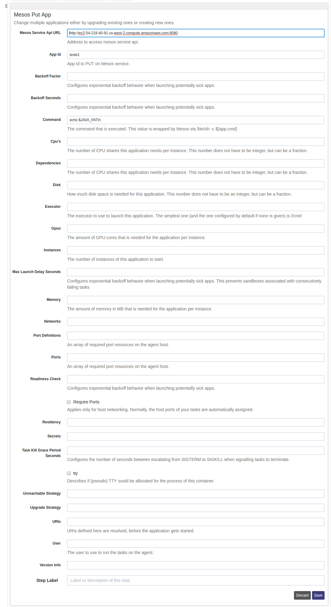
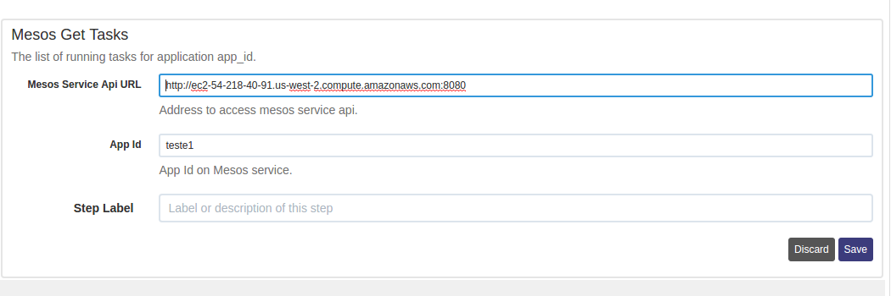
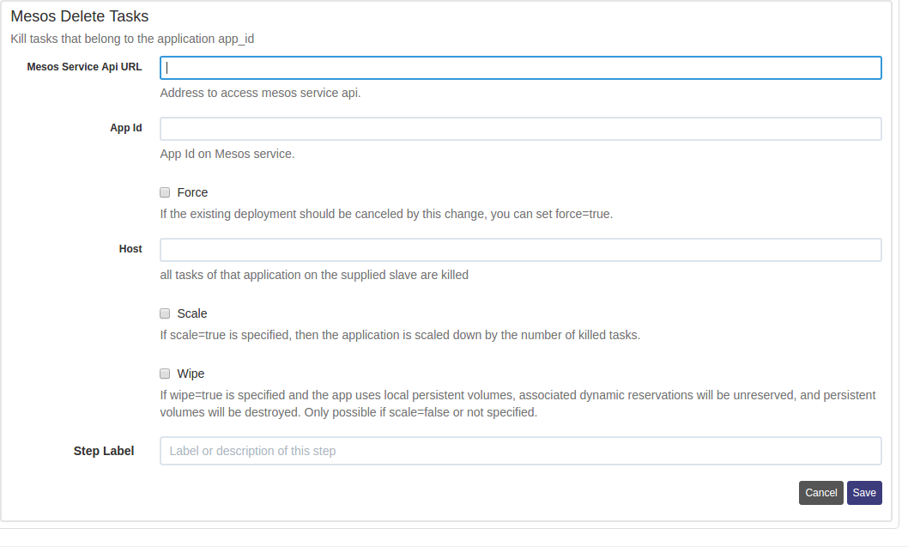

mesos-steps plugin
======================

Workflow steps to create and use apps and tasks.

Installation Instructions
-------------------------

See the [Included Plugins | Rundeck Documentation](http://rundeck.org/docs/plugins-user-guide/installing.html#included-plugins "Included Plugins") for more information on installing rundeck plugins.

## Build

1. build the source by gradle.
2. copy jarfile to `$RDECK_BASE/libext`

## Configurations
This plugin is used to get a list of running tasks for application, delete a task that belong to the application and create or change existing application.

See the [Marathon REST API Documentation](http://mesosphere.github.io/marathon/api-console/index.html). This plugin uses most of the parameters described there.

### Put App Configuration

The only required configuration settings are:

- `Mesos Service Api URL`: Mesosphere Service Api URL.
- `App Id`: Application Identifier.

### Get a list of running tasks for application.

The required configuration settings are:

- `Mesos Service Api URL`: Mesosphere Service Api URL.
- `App Id`: Application Identifier

### Delete Tasks that belong to the application.

The only required configuration settings are:

- `Mesos Service Api URL`: Mesosphere Service Api URL.
- `App Id`: Application Identifier.

